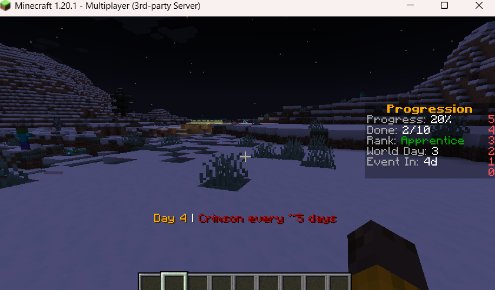

Description:
Minecraft is widely considered a fun game to play—it is calm, relaxing, and encourages creativity. Despite these strengths, Minecraft can lack long-term challenges for players. For years, the game has had the same final boss, the Ender Dragon, which many players are able to defeat within a few hours of starting a world. As a result, many players around the world seek more difficulty and progression, which is the problem our team is addressing with our mod: The Blood Moon.
The Blood Moon mod is our attempt not only to increase difficulty, but also to add more content for players to explore beyond the endgame. We introduce new mobs, bosses, and events designed to provide a greater challenge to the player. Additionally, we replace the traditional Minecraft leveling and achievement systems with a new progression system that ties directly into difficulty. As the player progresses, the game becomes increasingly more challenging.

Team members and responsibilities:

Jason(ypeng813):
World event(crimson descent)
Post end activation control
Custom event mob framework
Post end changes
Advanced ai behaviors

Max(MaxConk)
Super enchantment
New boss
Human readable config

Logan(CryoLunar)
Difficulty based loot multiplier

Dmitry(vlad-im)
Boss scaling logic
Player progression metric/ achievements

Evgenii(elikhovid)
Mob scaling
Documentation

Joseph(jantonacci-svg)
Mob variety
Creeper 
Skeleton 
Zombie
Enderman
Spider
Phantom
Day counter

Tech Stack:
Languages: Java
Local hosting: paper 1.20.1
Plugins: maven

Architecture Overview:
The Blood Moon project is a server-side plugin built for a Paper Minecraft server. It modifies gameplay by introducing custom mobs, world events, and a progression system that increases difficulty over time. The plugin listens to in-game events, manages player progression data, and dynamically adjusts mob behavior and world difficulty based on the current game state.
The system is modular, separating gameplay logic (mobs, events, progression) from server integration (listeners, commands, and configuration).

  +----------------------+
            |   Paper Server       |
            +----------+-----------+
                       |
                       v
            +----------------------+
            |   Plugin Core       |
            +----------+-----------+
                       |
     -----------------------------------------
     |           |            |              |
     v           v            v              v
+----------+ +-----------+ +-----------+ +-----------+
| Listeners| | Commands  | | Progress  | | Mob System|
+----------+ +-----------+ +-----------+ +-----------+
     |              |            |              |
     v              v            v              v
Events         Admin cmds   Difficulty     Custom mobs

Getting started:
Install java
Install Maven
Install the correct version of paper(1.20.1)
Make a folder(minecraft_repo)
Put the paper jar inside it
Open eula.txt and set it to true
Start server: java -jar paper-1.20.1.jar 
Create a folder structure src/main/resources 
Add pom.xml
Create in src/main/resources/plugin.yml and add
name: MyPlugin
version: 1.0
main: your.package.Main
api-version: 1.20
mvn clean package 
Go to target and copy the plugin
Then put the plugin into server/plugin
Then start the server java -jar paper-1.20.1.jar
Usage:

In game screenshot

Testing:

Use command: Mvn test;

Output:

[INFO] Scanning for projects...
[INFO] 
[INFO] ----------< com.example.worldsettings:world-settings-plugin >-----------
[INFO] Building WorldSettingsPlugin 1.0.0
[INFO]   from pom.xml
[INFO] --------------------------------[ jar ]---------------------------------
[INFO] 
[INFO] --- resources:3.4.0:resources (default-resources) @ world-settings-plugin ---
[INFO] Copying 2 resources from src\main\resources to target\classes
[INFO] 
[INFO] --- compiler:3.13.0:compile (default-compile) @ world-settings-plugin ---
[INFO] Nothing to compile - all classes are up to date.
[INFO] 
[INFO] --- resources:3.4.0:testResources (default-testResources) @ world-settings-plugin ---
[INFO] skip non existing resourceDirectory C:\Users\Master\Desktop\minecraft repo\minecraft_mod_spring_2026\src\test\resources
[INFO] 
[INFO] --- compiler:3.13.0:testCompile (default-testCompile) @ world-settings-plugin ---
[INFO] Nothing to compile - all classes are up to date.
[INFO] 
[INFO] --- surefire:3.3.0:test (default-test) @ world-settings-plugin ---
[INFO] Using auto detected provider org.apache.maven.surefire.junitplatform.JUnitPlatformProvider
[INFO] 
[INFO] -------------------------------------------------------
[INFO]  T E S T S
[INFO] -------------------------------------------------------
[INFO] Running com.example.worldsettings.boss.SuperEnchantmentTableIntegrationTest
[INFO] Tests run: 4, Failures: 0, Errors: 0, Skipped: 0, Time elapsed: 0.615 s -- in com.example.worldsettings.boss.SuperEnchantmentTableIntegrationTest
[INFO] Running com.example.worldsettings.boss.VoidDevourerSpawnerTest
[INFO] Tests run: 2, Failures: 0, Errors: 0, Skipped: 0, Time elapsed: 0.021 s -- in com.example.worldsettings.boss.VoidDevourerSpawnerTest
[INFO] Running com.example.worldsettings.gui.SettingsGUITest
[INFO] Tests run: 2, Failures: 0, Errors: 0, Skipped: 0, Time elapsed: 0.032 s -- in com.example.worldsettings.gui.SettingsGUITest
[INFO] Running com.example.worldsettings.integration.CrimsonDescentIntegrationTest
[INFO] Tests run: 1, Failures: 0, Errors: 0, Skipped: 0, Time elapsed: 0.296 s -- in com.example.worldsettings.integration.CrimsonDescentIntegrationTest
[INFO] Running com.example.worldsettings.listeners.CrimsonDescentLogicTest
[INFO] Tests run: 2, Failures: 0, Errors: 0, Skipped: 0, Time elapsed: 0.006 s -- in com.example.worldsettings.listeners.CrimsonDescentLogicTest
[INFO] Running com.example.worldsettings.listeners.DragonEggDestructionListenerTest
[INFO] Tests run: 3, Failures: 0, Errors: 0, Skipped: 0, Time elapsed: 0.015 s -- in com.example.worldsettings.listeners.DragonEggDestructionListenerTest
[INFO] Running com.example.worldsettings.mobs.HellCreeperTest
WARNING: A Java agent has been loaded dynamically (C:\Users\Master\.m2\repository\net\bytebuddy\byte-buddy-agent\1.14.12\byte-buddy-agent-1.14.12.jar)
WARNING: If a serviceability tool is in use, please run with -XX:+EnableDynamicAgentLoading to hide this warning
WARNING: If a serviceability tool is not in use, please run with -Djdk.instrument.traceUsage for more information
WARNING: Dynamic loading of agents will be disallowed by default in a future release
OpenJDK 64-Bit Server VM warning: Sharing is only supported for boot loader classes because bootstrap classpath has been appended
[INFO] Tests run: 2, Failures: 0, Errors: 0, Skipped: 0, Time elapsed: 5.779 s -- in com.example.worldsettings.mobs.HellCreeperTest
[INFO] Running com.example.worldsettings.mobs.HellEndermanTest
[INFO] Tests run: 2, Failures: 0, Errors: 0, Skipped: 0, Time elapsed: 0.844 s -- in com.example.worldsettings.mobs.HellEndermanTest
[INFO] Running com.example.worldsettings.mobs.HellPhantomTest
[INFO] Tests run: 2, Failures: 0, Errors: 0, Skipped: 0, Time elapsed: 0.366 s -- in com.example.worldsettings.mobs.HellPhantomTest
[INFO] Running com.example.worldsettings.mobs.HellSkeletonTest
[INFO] Tests run: 2, Failures: 0, Errors: 0, Skipped: 0, Time elapsed: 0.218 s -- in com.example.worldsettings.mobs.HellSkeletonTest
[INFO] Running com.example.worldsettings.mobs.HellSpiderTest
[INFO] Tests run: 2, Failures: 0, Errors: 0, Skipped: 0, Time elapsed: 0.168 s -- in com.example.worldsettings.mobs.HellSpiderTest
[INFO] Running com.example.worldsettings.mobs.HellZombieTest
[INFO] Tests run: 2, Failures: 0, Errors: 0, Skipped: 0, Time elapsed: 0.426 s -- in com.example.worldsettings.mobs.HellZombieTest
[INFO] Running com.example.worldsettings.ModdedItemsTest
[INFO] Tests run: 3, Failures: 0, Errors: 0, Skipped: 0, Time elapsed: 0.079 s -- in com.example.worldsettings.ModdedItemsTest
[INFO] Running com.example.worldsettings.settings.WorldSettingsTest
[INFO] Tests run: 2, Failures: 0, Errors: 0, Skipped: 0, Time elapsed: 0.033 s -- in com.example.worldsettings.settings.WorldSettingsTest
[INFO] 
[INFO] Results:
[INFO] 
[INFO] Tests run: 31, Failures: 0, Errors: 0, Skipped: 0
[INFO] 
[INFO] ------------------------------------------------------------------------
[INFO] BUILD SUCCESS
[INFO] ------------------------------------------------------------------------
[INFO] Total time:  14.771 s
[INFO] Finished at: 2026-05-12T21:08:34-04:00
[INFO] ------------------------------------------------------------------------

Project management:

Link to kanban board: https://github.com/orgs/drew-csci/projects/5

Branching strategy: create new branches for each different features

PR strategy: Jason handled PRs

Contributors:

Jason: https://github.com/ypeng813
Max: https://github.com/MaxConk
Logan: https://github.com/CryoLunar
Dmitry: https://github.com/vlad-im
Evgenii: https://github.com/elikhovid
Joseph: https://github.com/jantonacci-svg

Acknowledgements:

Ai was used to help design this mod. Ai used:
Copilot
Claude
Gemini
